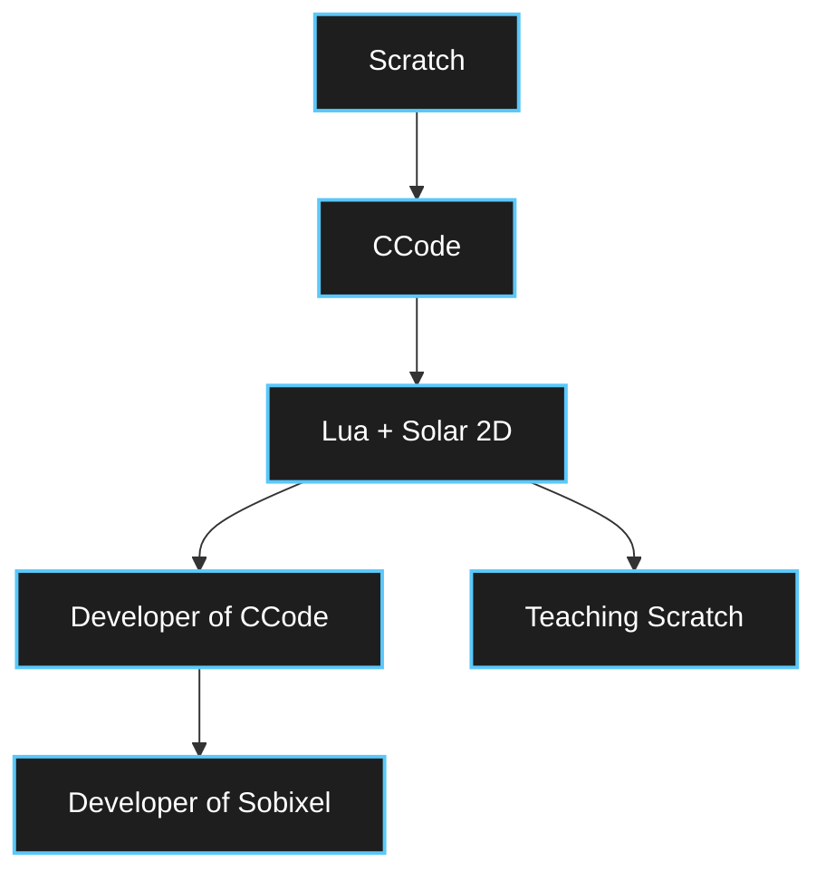
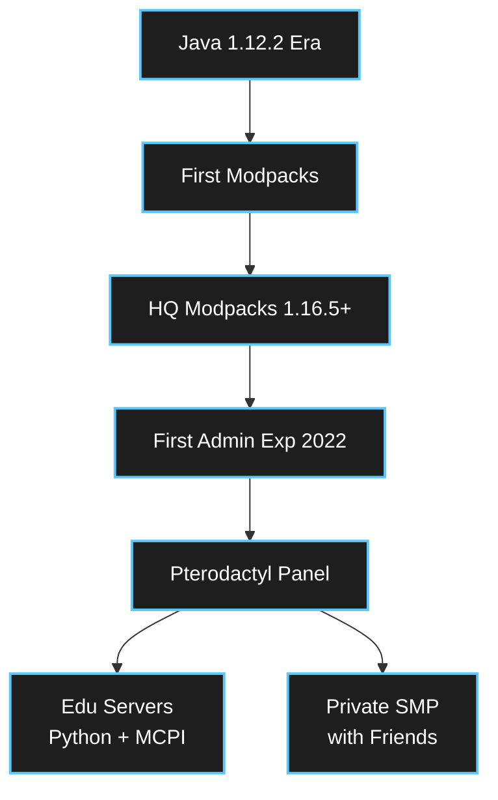

---

### ☕ About Me

I code for the sheer joy of creation and the satisfaction of automating the mundane. For me, development isn't just work — it's a lifestyle of making things efficient and beautiful.

*   **Philosophy:** "Simplicity is the ultimate sophistication."
*   **Daily Driver:** **CachyOS** (Arch Linux) running a customized **KDE Plasma** desktop.
*   **Co-Pilot:** All code is reviewed by **Sherry**, my Corgi 🐕.

### 🎓 Education & Mentorship

Beyond the screen, I am passionate about shaping young minds. I actively teach:
*   **Programming**
*   **Mathematics**
*   **Design**

---

### 🧩 My Visual Programming Journey

My path wasn't linear — it was a loop of discovery and contribution.

1.  **The Spark:** It all started with **Scratch**, learning the fundamentals of logic.
2.  **The Deep Dive:** I discovered **CCode** and became an avid enthusiast.
3.  **The Evolution:** I mastered **Lua + Solar 2D**, which allowed me to contribute to the engine itself.
4.  **The Return:** While developing the **Sobixel** engine, I use that deep technical knowledge to teach Scratch to the next generation.

---

### ⛏️ Minecraft Engineering

  
  &nbsp;&nbsp;&nbsp;&nbsp;
  
  &nbsp;&nbsp;&nbsp;&nbsp;
  

 

To me, Minecraft is a platform for engineering and education, not just a game.

*   **Engineering:** I host a **Java 1.21.10 server** tailored for **Python + MCPI**, allowing real-time coding interaction with the game world.
*   **Education:** I leverage **Minecraft Education** combined with **Microsoft MakeCode** to teach algorithmic thinking.
*   **Community:** I maintain private servers for friends to explore and build together.

---

### 🖥️ Self-Hosted Lab

I maintain a robust homelab/VPS environment to ensure data privacy and service reliability.

| Service | Name | Description |
| :---: | :--- | :--- |
|  | **Nextcloud** | Private cloud storage and collaboration hub. |
|  | **Pterodactyl** | **(Core)** Advanced game server management panel. |
|  | **Jitsi Meet** | Secure, open-source video conferencing. |
|  | **Marzban** | Modern proxy and VPN management tool. |
|  | **Nginx PM** | Reverse proxy management and SSL handling. |

---

### 🛠️ Tech Stack

| Category | Technologies |
| :--- | :--- |
| **Languages** |    |
| **GameDev / Libs** | `Solar 2D` `PyGame` `Aiogram` `MCPI` |
| **Infrastructure** |     |
| **Markup** |    |

 
